# Rimini Ravennna and Bologna

In addition to our battlefield and tiny country tours, we took the
opportunity to explore the ancient cities of Rimini, Ravenna and Bologna
during our visit to Italy. All of the cities have impressive structures
that are thousands of years old.

# Rimini

Rimini has been inhabited from ancient times but was created as a Roman
city in 268 BC when 6,000 Romans were sent to Rimini to establish a base
at the mouth of the Marecchia River to expand into the Po Valley.

The beaches of Rimini are a huge attraction these days. The view from
our hotel shows the beaches being prepared for the upcoming summer
season. Each hotel has a separate strip of land that is populated with
beach chairs rentable by the day.

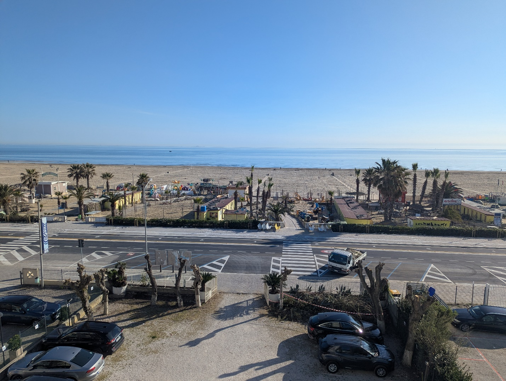

# Rimini Landmarks

An illustration of ancient Rimini, showing the Arch of Augustus, the
Tiberius Bridge, Roman Coliseum and Forum.

## Arch of Augustus

The Arch of Augustus was built in 27 BC as the gateway to Via Flaminia,
the road linking Rimini to Rome, honouring Emperor Augustus. The Arch
was originally integrated into the walls surrounding Rimini. The walls
and surrounding buildings were demolished in 1936 to create a
free-standing monument, the oldest arch in Italy.

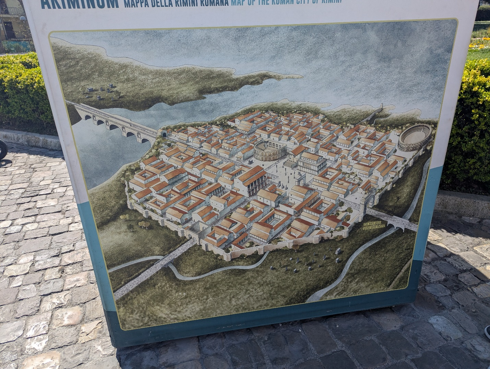

The faces of Jupiter and Zeus adorn the outside of the arch.

Rimini was a major German supply and communication hub so it was bombed
373 times in 1943 and 1944, resulting in 98% of the buildings of the
city being damaged. Remarkably, the Arch was not damaged. A view of the
arch when the Allies captured the city. A disabled Calgary Regiment tank
in front of the Arch.

During the German retreat, the order was given to destroy the Arch. The
following story explains how the Arch was saved.

> *Trageser refused to blow up the Arch of Augustus. The task had been
> entrusted to him by Lieutenant Renberg and was to be carried out by a
> young non-commissioned officer originally from the Sudetenland, whose
> name Trageser – in the conversation reported by Montemaggi – did not
> remember: "I personally gave the order not to blow up the Arch,
> assuming full responsibility for it... It seemed absurd to me to
> destroy a historical monument of this kind and achieve no result,
> given that the arch was isolated in the middle of a square and
> therefore traffic could have continued perfectly well, both to the
> right and left of the monument itself... "*
>
> *Interestingly, however, the Arch faced greater danger with the
> arrival of the British. Montemaggi, in fact, recalls the struggles
> that Public Works Councillor Mario Macina had to wage with British
> engineers to prevent the monumental stones from being used to
> consolidate the surface of the numerous roads destroyed by the tracks
> and wheels of thousands of vehicles.*
>
> *Once, the Arch was miraculously saved by Sergio Santarini , a middle
> school principal from Rimini, who happened to be passing by the
> monument and saw a team of black South Africans and mixed-race people
> from Mauritius, part of the Engineering Corps, who had already chained
> the monument to demolish it.*
>
> *Horrified, he ran to the offices of the Town Mayor (the British
> Governor) to report what he had seen. The British took action and
> cleared up the misunderstanding.*

## Tiberius Bridge

Another ancient landmark of Rimini is the Tiberius Bridge, one of the
best-preserved Roman bridges in the world completed in 21 AD, with 5
semicircular arches spanning 70 metres.

Again, it was a miracle the bridge survived the war. The multiple
bombings did not severely damage the bridge. Also, during their retreat,
the Germans tried to blow up the Tiberius Bridge as they had all of the
other bridges in the area. There are several stories as to why the
bridge survived. One was the German Officer in charge refused to destroy
the ancient landmark, others included the bridge design was too robust,
the explosives were faulty or the Germans needed the bridge to escape
and waited too long to detonate.

A modern narrative source recounts that a German officer—identified as
Marshal Trek Esere—deliberately disobeyed the order to destroy the
bridge, sparing it as an act of personal defiance. This account
describes how the demolition cavities were prepared, but the officer
chose not to complete the destruction.

While this story is compelling, it appears in contemporary retellings
rather than primary wartime documentation. It should be treated as a
plausible but not definitively proven explanation.

## ** Piazza Tre Martiri (Roman Forum)**

The Piazza Tre Martiri sits on top of the ancient Roman Forum. It is
named the Square of the Three Martyrs for the three Italian partisans
who were executed in August 1944, just before the liberation of the
city.

Julius Caeser made a famous speech after crossing the Rubicon and a
statue of him adorns the square.

The clock tower dates from 1547 and features a second dial that tracks
the zodiac signs and the phases of the moon.

Clock tower in WW2.

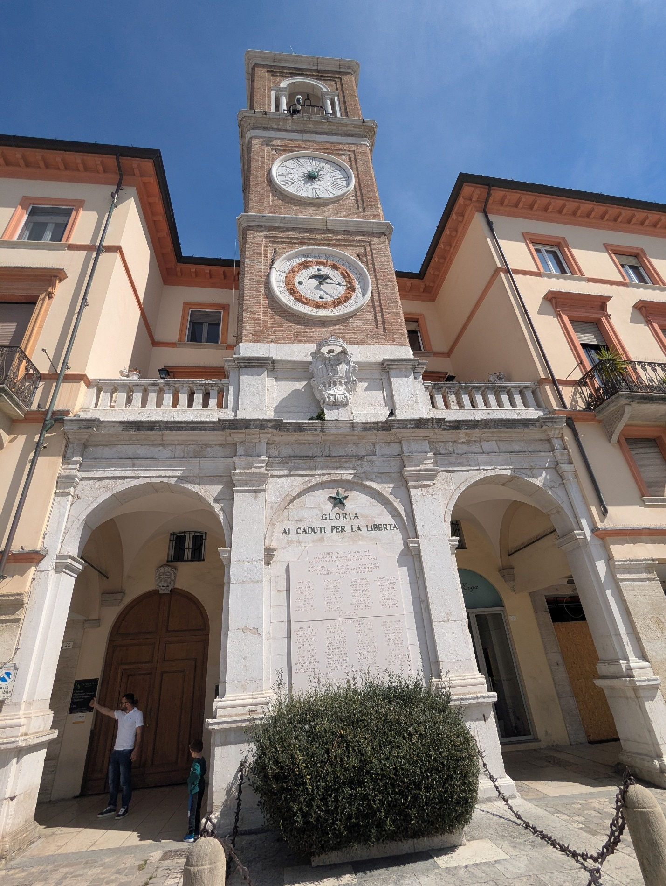

## Malatestian Temple

The Malatestian Temple (*Tempio Malatestiano*) in Rimini is a landmark
of the Italian Renaissance, representing the ambitious transformation of
a 13th-century Gothic church into a monumental dynastic mausoleum.
Today, the building serves as the **Cathedral of Rimini** (dedicated to
St. Columba). It suffered significant damage during WWII bombings but
was meticulously restored in the 1950s.

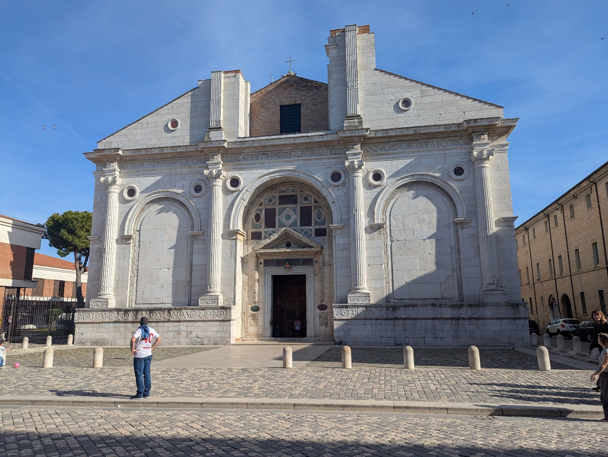

The temple was constructed at the direction of Sigismondo Malatesta in
honour of his lover and later wife, Isotta degli Atti. The construction
started in 1447 on the site of a 13th century church. The
chapel was constructed quickly but the proposed dome was never
constructed due to Sigismondo’s death in 1468, leading to an unfinished
look. The intertwined initials of I and S feature prominently as do
sculptures of Elephants, Sigismondo’s personal symbol. His tag line was
“Elephas Indus cullices non timet”. For those of you whose Latin is a
bit rusty: “The Indian Elephant does not fear mosquitoes”. This was a
shot at the Pope, who later had Sigismondo excommunicated.

The I/S symbol is everywhere.

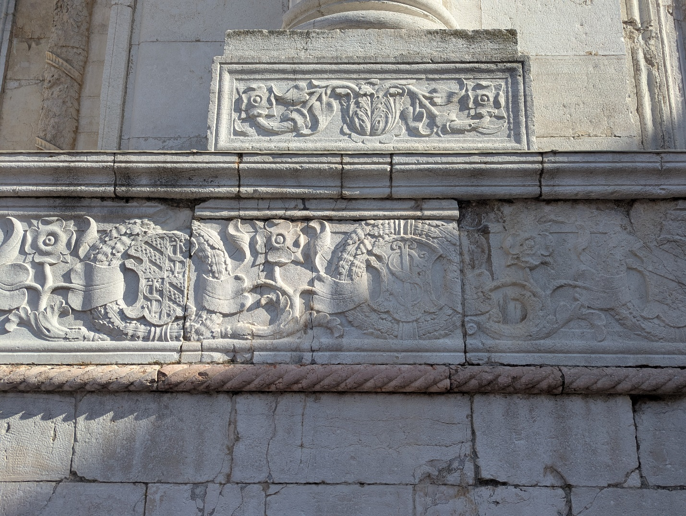

## Castel Sismondo

Castel Sismondo is a formidable 15th-century fortress located in the
heart of Rimini. Built by Sigismondo Pandolfo Malatesta (same guy as
previous building), the ruler of Rimini, it served as both a defensive
stronghold and a grand princely residence. Today, the castle has been
completely reimagined. It now serves as a primary wing of the Federico
Fellini Museum, dedicated to the legendary film director who was born in
Rimini.

Since 1857, the castle was used as a prison. During WW2, bombing heavily
damaged the castle and one bomb destroyed the front gate allowing
prisoners to escape. Rachel didn’t see any while inspecting the
renovated door.

The building across the street was aslo heavily damaged.

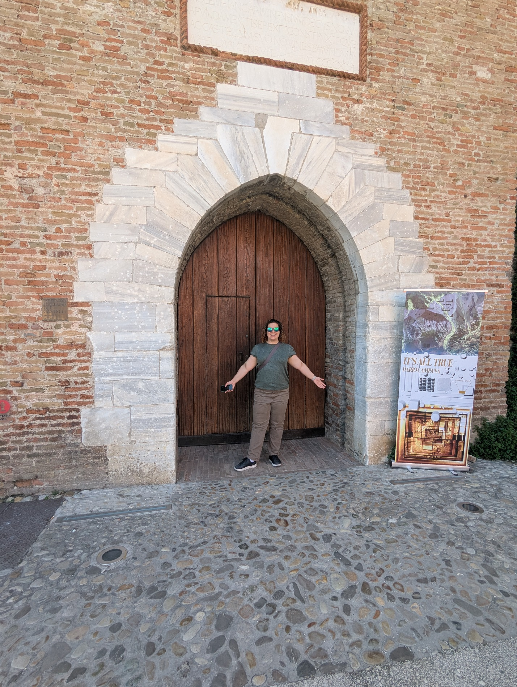

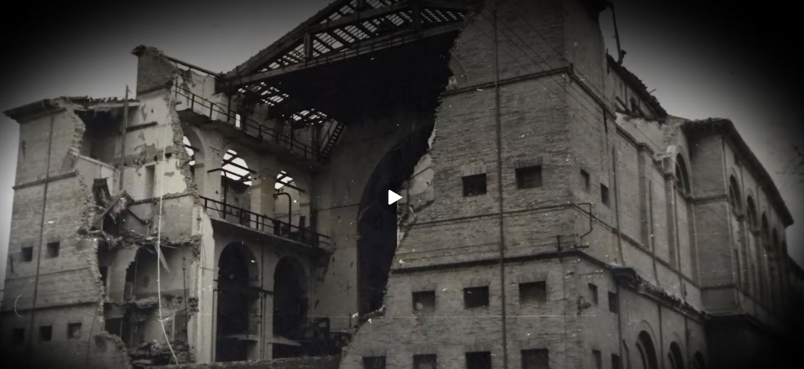

### Domus del Chirurgo

The Domus del Chirurgo (Surgeon’s House) is an extraordinary
archaeological site in Rimini, often described as a "little Pompeii"
because of its remarkable state of preservation. A purpose-built
structure now protects the discovery.

Discovered in 1989 during renovations to the Piazza Ferrari, this Roman
villa provides a rare, frozen-in-time look at medical life in the 3rd
century AD. A fire in the late 3rd century destroyed the
building, collapsed the roof and buried rooms under the rubble. The site
subsequently became a garden, an orchard then an open space, so no heavy
construction destroyed the Roman ruins.

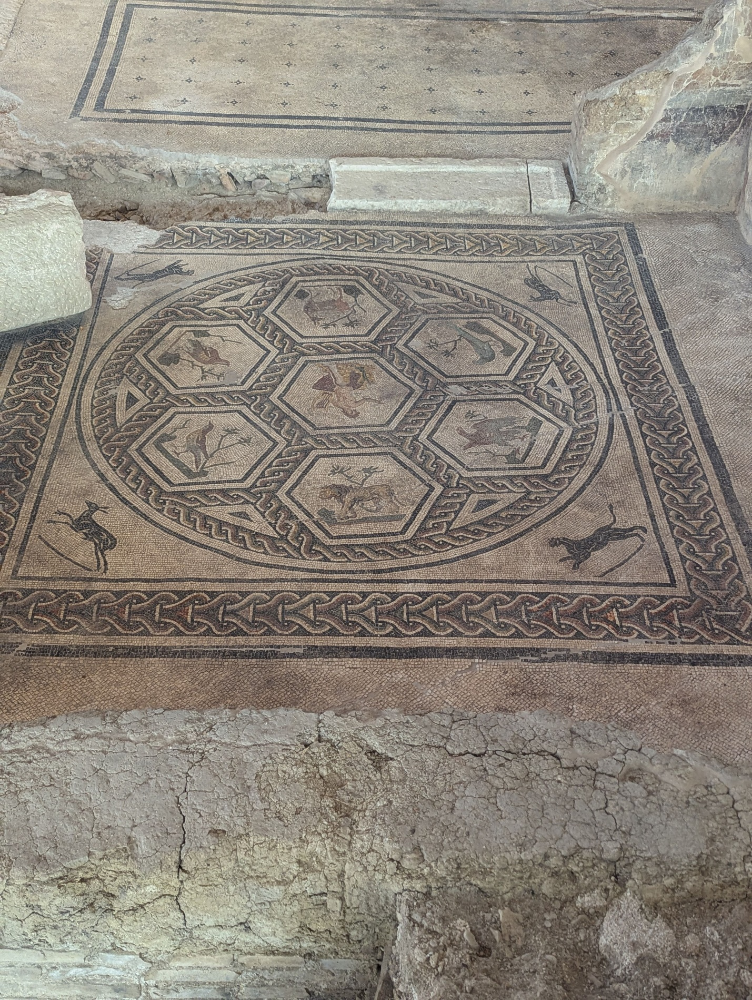

Along with well preserved mosaics, a 150-piece surgical kit was also
discovered. Remarkably precise tools were found during the archeological
dig.

## **Murales del borgo San Giuliano**

The Murales del Borgo San Giuliano are a vibrant collection of wall
paintings that decorate the historic fishermen's quarter of Rimini,
located just across the ancient Ponte di Tiberio (Bridge of Tiberius).

Once a poor, marginalized neighborhood, Borgo San Giuliano has
transformed into one of the most picturesque and "Instagrammable" areas
of the city thanks to these artworks.

## 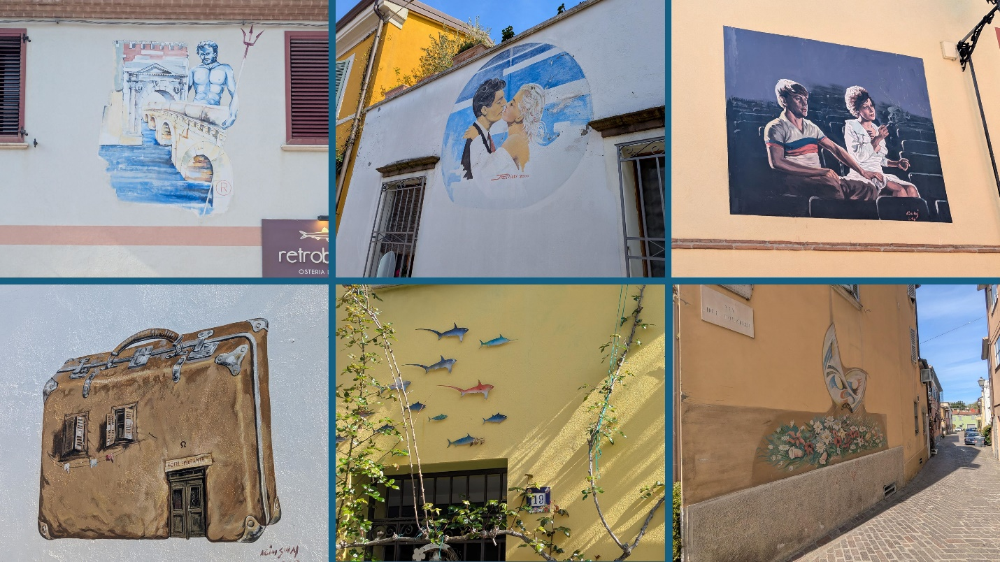

## Roman Amphitheatre

The Roman Amphitheatre in Rimini was a massive 2nd century
arena built under Emperor Hadrian, confirmed with a coin bearing his
likeness embedded in the masonry. The Amphitheatre of holding
10,000–12,000 spectators, and today only fragments survive due to
medieval reuse and WWII bombing.

Constructed in brick with a classic elliptical plan, similar in
proportions to the Colosseum.

- Major axis: 118 m

- Minor axis: 88 m

- Arena: ~74 × 45 m

- Height: 16–17 m

- Exterior portico: 60 arches

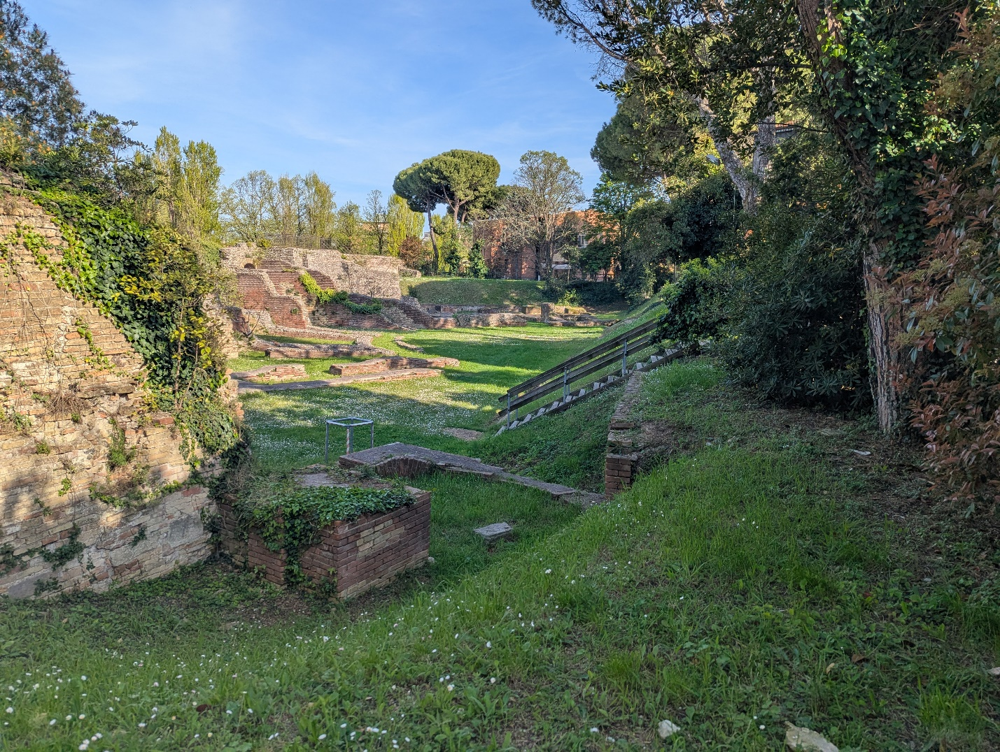

This scale made it one of the largest amphitheatres in northern Italy
and the only one still partially surviving in Emilia‑Romagna. The
amphitheatre was built into the defensive walls of Rimini and after the
decline of the Roman Empire used as a quarry for other buildings. It was
rediscovered in the 1840’s but severe damage caused by WW2 bombing mean
only fragments remain today.

Translation of a plaque outside the building.

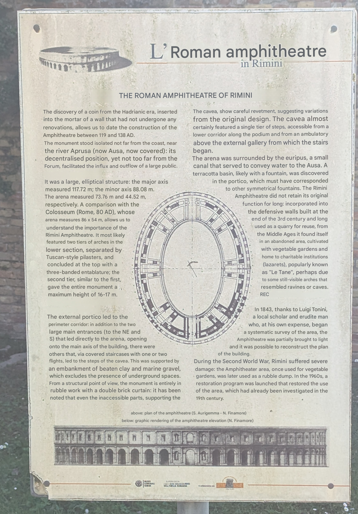

And as always, we had a great lunch at La Mi Mama, recommended by Maggy,
Rachel’s Italian buddy.

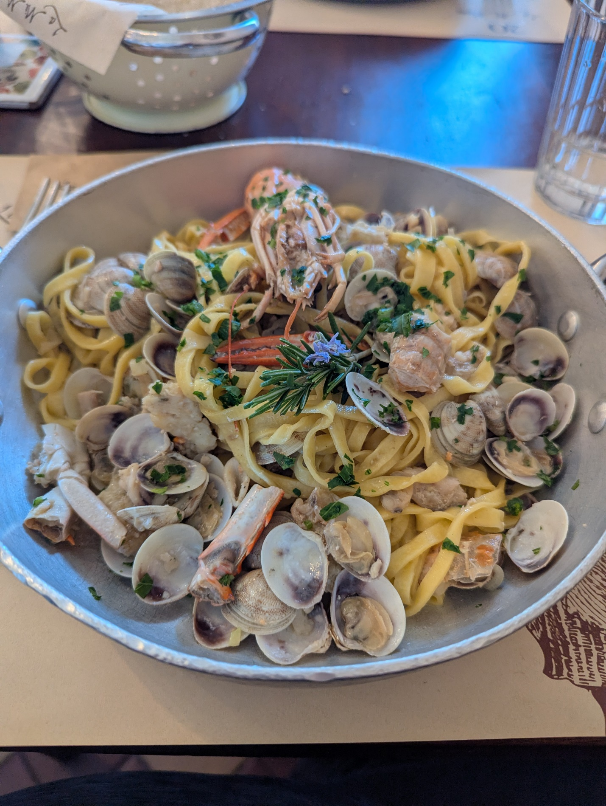

## Ravenna

Ravenna was started as an Adriatic port city, connected to the sea by
canals. In 402 AD the capital of the Western Roman Empire was moved from
Milan to Ravenna because of the marshy ground surrounding it was a
natural defence and the canals provided easy naval access. The capital
was moved from Rome to Milan in 286 AD as it was closer to the northern
frontiers where most of the Military crises were occurring and was
easier to defend than Rome.

Wealth and artisans flowed into Ravenna, laying the foundations for the
early Christian mosaic traditions. The Mausoleum of Galla Placidia was
built around 425 AD

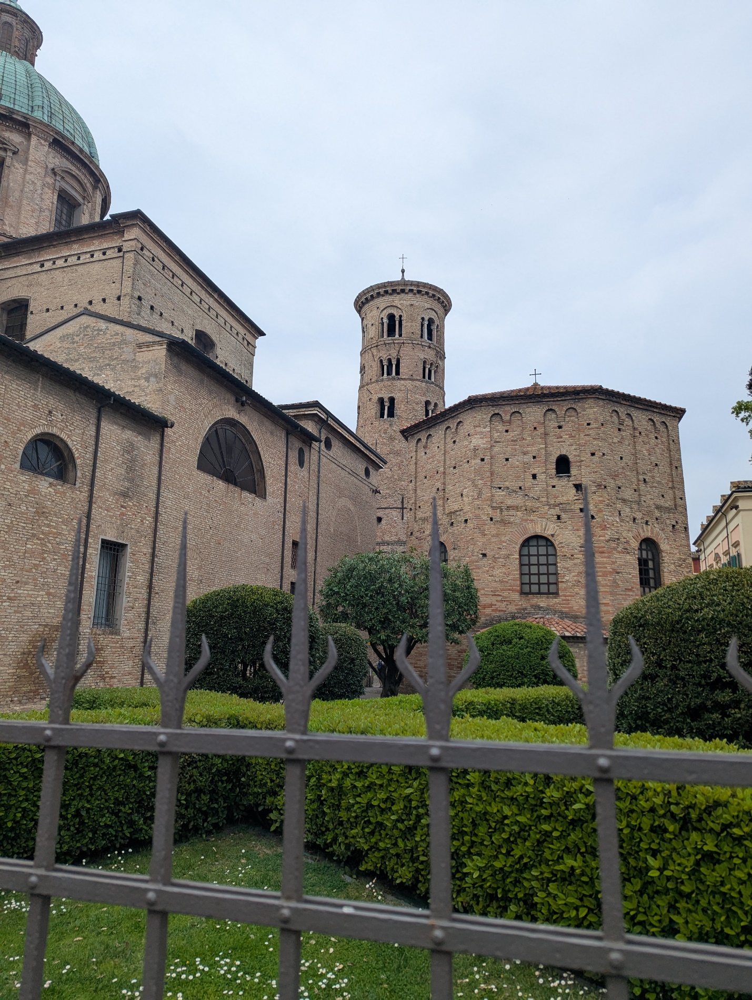

In 493 AD Ravenna became the capital of the Ostrogoths for 50 years and
the Bascillica of Sant ’Apollinare Nuovo was built, continuing with the
intricate mosaic designs. The Ostrogoths were Gothic people originally
from the Eastern Germany region.

The Basilica has a procession of martyrs marching toward Jesus on one
wall, and a procession of virgins marching toward Mary on the other
wall.

The ceiling is also elaborately tiled. Sant ‘Apollinare was bombed
during WW2, the building structure was damaged, but the mosaics remained
largely intact.

The Byzantines captured Ravenna in 540 AD and made it the capital of
Byzantine Italy. The Byzantines were people of the Eastern Roman Empire
who spoke Greek.

San Vitale from 547 AD was the most important church in the West.

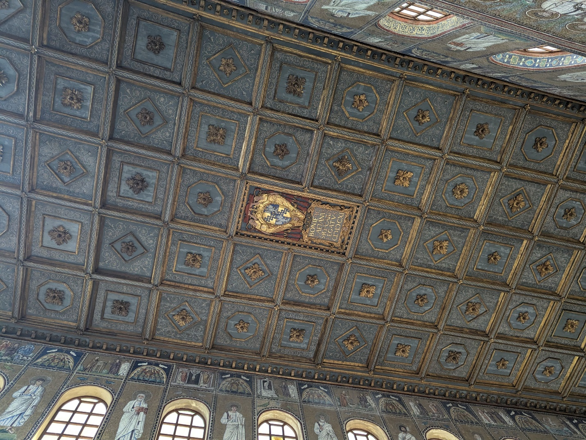

Unbelievably intricate work in the dome.

Heavily figured African marble adorns the pillars.

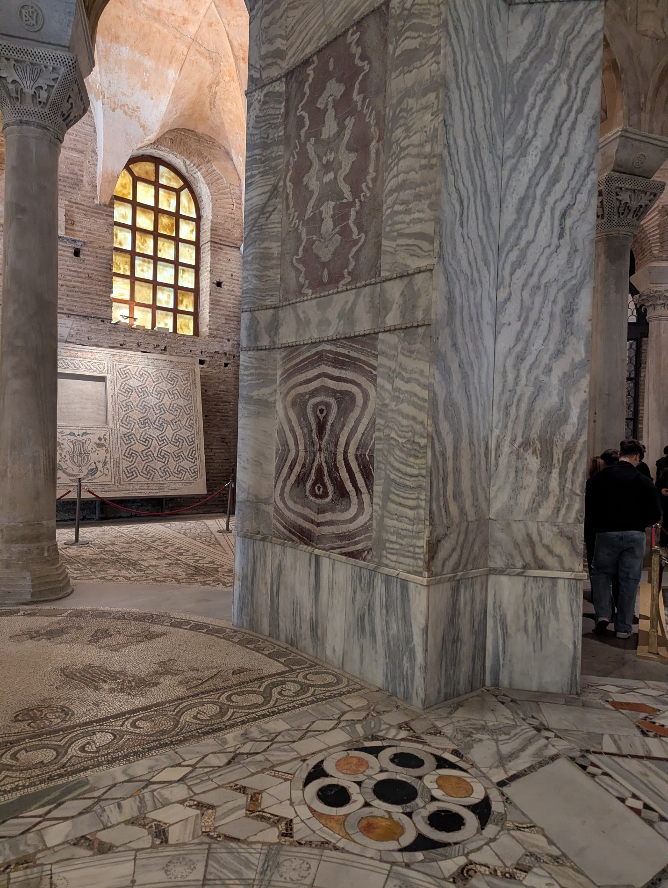Mosaics also cover the floors.

The Lombards conquered Ravenna and most of Italy in 751 AD. Ravenna
became much less important and no money was spent on churches. The
mosaics survived through benign neglect and were left untouched until
the 19th century.

Ravenna today has eight UNESCO world heritage sites and contains the
best-preserved mosaics, dating back more than 1,500 years. The photos do
not do justice to the scale and extent of the mosaics. We did a tour
with a guide we suspect was an art history major as her knowledge and
passion for the subject was well beyond standard tour guide patter.

# Bologna

Rachel’s buddy Maggy is from Bologna, and since we were flying in and
out from Bologna, it was essential that we visit. Bologna has been
inhabited since ancient times, becoming a Roman city in 189 BC and
transferred control through The Visigoths, Goths, Huns and Lombards
following the fall of the Roman Empire.

In 1088 the University of Bologna was established, the oldest university
in Europe. The iconic towers of Asinelli and Garisenda built starting in
1109 and used for signalling and defence. Garisenda, the smaller tower,
has a 4-degree lean equivalent to the leaning tower of Pisa due to
unstable ground under the tower. The lean is accelerating so work is
underway to stabilize the tower.
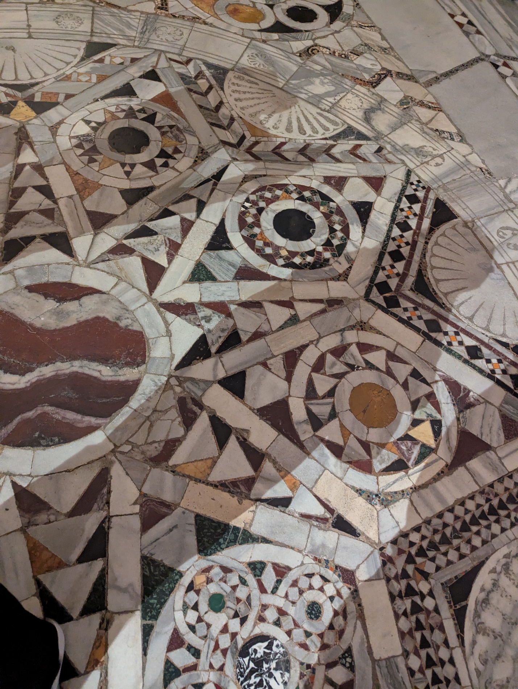

The lean is more evident from this angle.

## Basilica di San Petronio

The Basilica di San Petronio is Bologna’s great unfinished Gothic
Basilica, begun in 1390 as a massive civic church intended to surpass
St. Peter’s in Rome, but never completed due to political, financial,
and architectural obstacles.

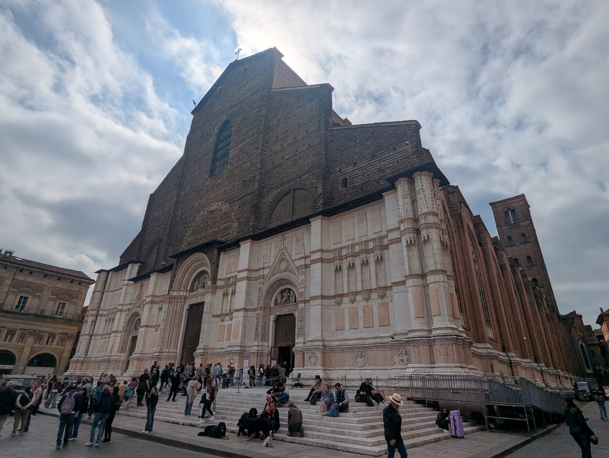

The Basilica design is Italian Gothic with a Capacity of approximately
28,000 people (one of the largest churches in Europe)

The unfinished façade is one of Bologna’s most recognizable features.
Only the lower marble portion was completed; the upper half remains
brick.

Inside the left aisle is a 1655 astronomical sundial created by Gian
Domenico Cassini. A small hole in the vault projects sunlight onto a
67‑meter meridian line that was used to measure the solar year with
extraordinary precision.

The hole projects a spot on the meridian line. The shape of the spot
depends on the time of year.

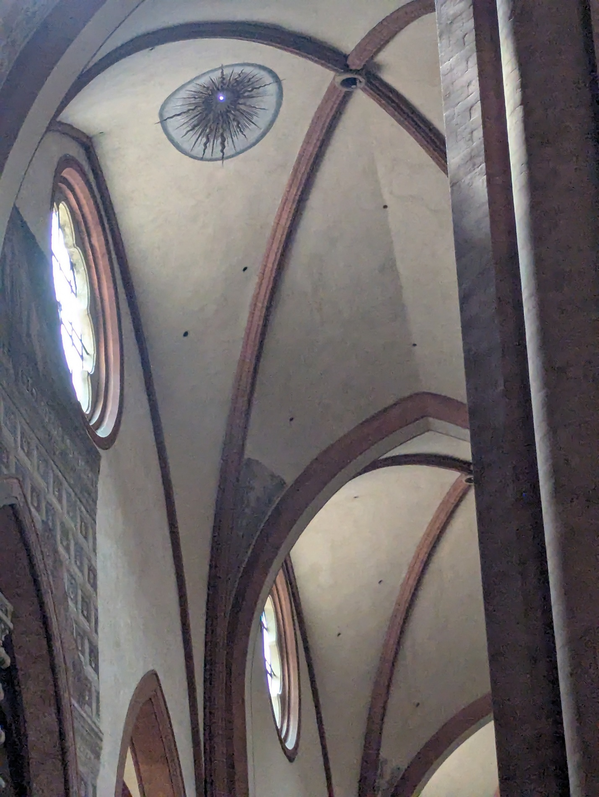

The spot tracing the meridian line.

The Basilica has 22 side chapels in its massive interior.

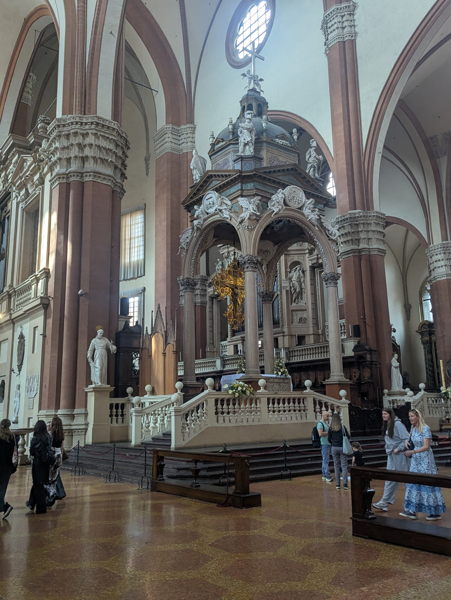Bologna was heavily bombed during
WW2 and the Basilica suffered some damage. The precious relics were
protected and the massive Gothic structure meant it survived more intact
than many of the surrounding buildings.

## Archiginnasio Library

The most famous library in Bologna and one of the most important in all
of Italy is the Archiginnasio Library (Biblioteca Comunale
dell’Archiginnasio). It is the historic library of the University of
Bologna, the oldest university in Europe (founded 1088). It holds over
850,000 volumes, including rare manuscripts, incunabula (books printed
before 1501), and early printed books.

The library sits inside the Archiginnasio Palace, one of Bologna’s most
beautiful Renaissance buildings.
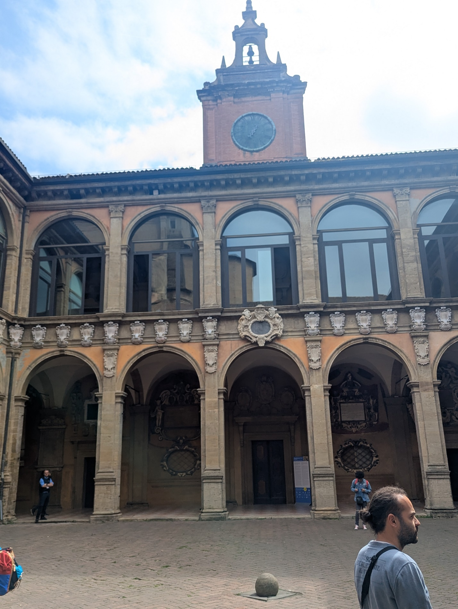It survived WWII bombing, though
part of the building was destroyed in 1944 and later rebuilt. Elaborate
coats of arms over the ages adorn the library walls.

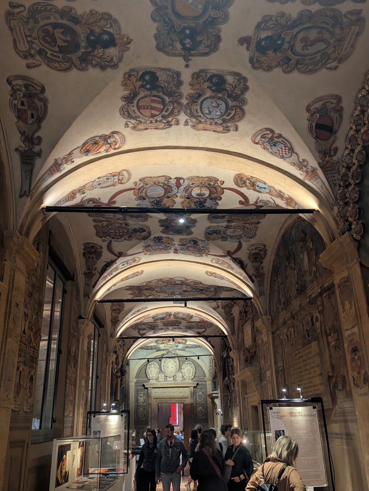

We came upon a cute market with very high-end products. Lots of lookers
but not too many buyers.

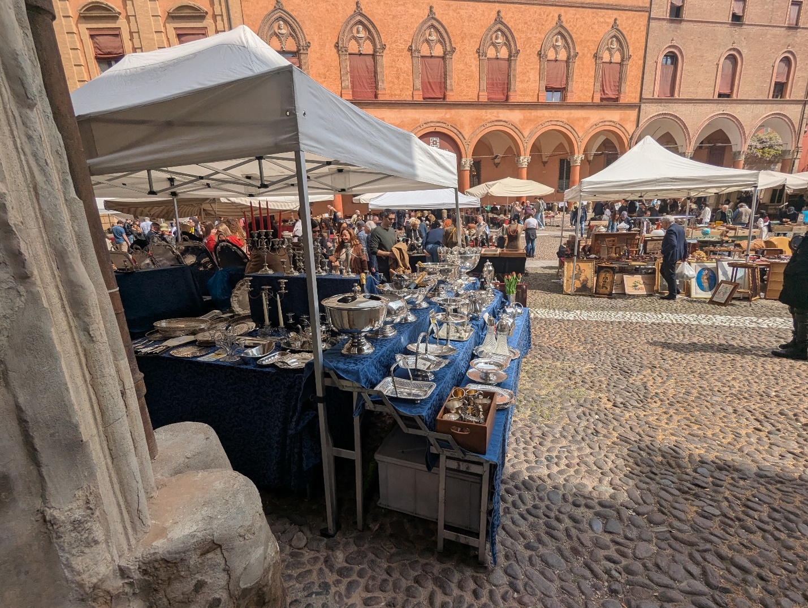

# Santo Stefano Complex

Bologna’s most distinctive collection of churches is the Santo Stefano
complex, also known as the Sette Chiese (“Seven Churches”), a unique
cluster of interconnected religious buildings forming a single sacred
labyrinth. It is the city’s most unusual religious site: a fusion of
multiple churches, courtyards, cloisters, and monastic structures built
across more than 1,500 years.

Although popularly called the Seven Churches, the number has changed
over time. Historically seven, today four main churches remain, but the
name persists because of the symbolic and architectural unity of the
site.

The walking map shows how the churches are linked together.

The complex began in the **5th century**, when **Bishop Petronius**
built a church over the remains of a Roman temple dedicated to the
goddess Isis. His intention, according to tradition, was to recreate the
sacred sites of Jerusalem—especially the Holy Sepulchre—within Bologna.

Over the centuries, **Franks**, **Lombards**, and later **Benedictine
monks** expanded and reshaped the complex (10th
–13th centuries), adding chapels, cloisters, and monastic
buildings.

## The main components of the Santo Stefano complex

Below is an overview of the principal structures within the collection:

- **Chiesa del Crocifisso (Church of the Crucifix)**  
  A 7th century Lombard church, austere in style, containing
  a 14th century crucifix by Simone dei Crocifissi.

- **Chiesa del Santo Sepolcro (Church of the Holy Sepulchre)**  
  Octagonal, built to imitate the Holy Sepulchre in Jerusalem;
  originally from the 5th century, rebuilt in the
  12th.

- **Chiesa dei Santi Vitale e Agricola**  
  Houses the sarcophagi of Bologna’s early Christian martyrs Vitale and
  Agricola.

- **Chiesa della Trinità (Church of the Trinity)**  
  Reworked in the 12th –13th centuries; notable
  for its medieval wooden sculptures and Romanesque capitals.

- **Cortile di Pilato (Courtyard of Pilate)**  
  Contains an 8th ‑century marble basin donated by Lombard
  kings Liutprand and Hildeprand.

- **Medieval Cloister**  
  A two‑level Romanesque cloister (10th–13th
  centuries), one of the finest in Emilia‑Romagna.

- **Santo Stefano Museum**  
  Displays artworks from the complex, including works by Vitale da
  Bologna and Simone dei Crocifissi.

**Chiesa del Crocifisso (Church of the Crucifix)**

**Chiesa del Santo Sepolcro (Church of the Holy Sepulchre)**

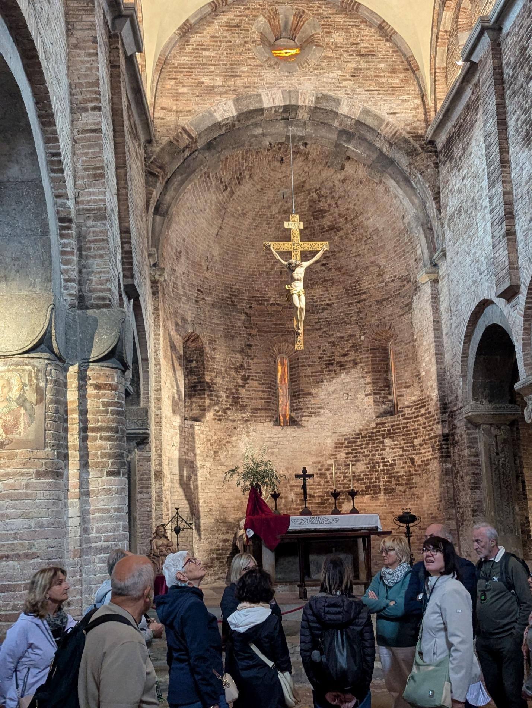

Basilica of San Stefano

# Final Thoughts

The most exotic meal I had was a local delicacy, Mediterranean style
Turbot. The entire fish was delivered on a giant platter, covered with
sauce and potatoes. The fish was delicious, but Turbot, being a flat
fish, is very thin so it was an adventure digging out the meat from the
many, many bones. I enjoyed a lot of seafood in many forms, but this was
the most unique.

It was a great trip to Italy. The food was wonderful everywhere we ate
and any of the tours we did, Battlefield Touring, visit to San Marino or
turning the ancient Roman cities of Rimini, Ravenna and Bologna would
have made for a great trip. The weather was spectacular and the visits
were magnificent.

Touring the ancient cities of Rimini, Ravenna and Bologna and seeing
structures that are 2,000 years old gives you an appreciation of what
old really means. The craftmanship and engineering knowledge to create
structures that last millennia and survive multiple regime changes and
innumerable wars is a testament to skills of the ancients.

This is not a location that is top of anyone’s list of a must visit in
Italy, but combination of ancient and military history and the
collection of another tiny country made this one of our top travels.
